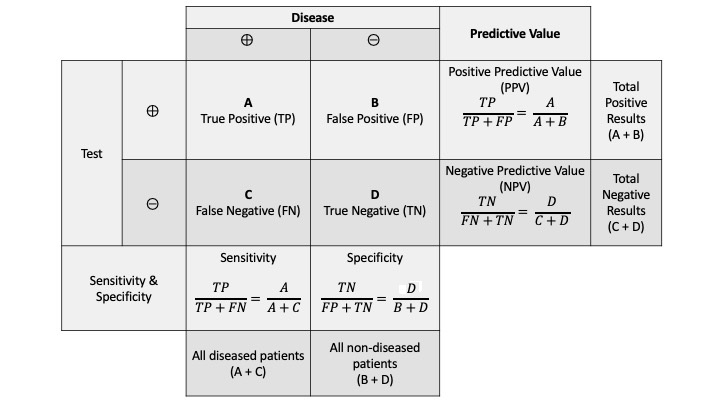

# MASEF Hepatology Data

**Serum identification of at-risk MASH: The metabolomics-advanced steatohepatitis fibrosis score (MASEF)**


## Abstract

**Background**: Early identification of those with NAFLD activity score ≥ 4 and significant fibrosis ( ≥ F2) or at-risk metabolic dysfunction-associated steatohepatitis (MASH) is a priority as these patients are at increased risk for disease progression and may benefit from therapies. We developed and validated a highly specific metabolomics-driven score to identify at-risk MASH.

**Methods**: We included derivation (n = 790) and validation (n = 565) cohorts from international tertiary centers. Patients underwent laboratory assessment and liver biopsy for metabolic dysfunction-associated steatotic liver disease. Based on 12 lipids, body mass index, aspartate amino-transferase, and alanine aminotransferase, the MASEF score was developed to identify at-risk MASH and compared to the FibroScan-AST (FAST) score. We further compared the performance of a FIB-4 + MASEF algorithm to that of FIB-4 + liver stiffness measurements (LSM) by vibration-controlled transient elastography (VCTE).

**Results**: The diagnostic performance of the MASEF score showed an area under the receiver-operating characteristic curve, sensitivity, specificity, and positive and negative predictive values of 0.76 (95% CI 0.72–0.79), 0.69, 0.74, 0.53, and 0.85 in the derivation cohort, and 0.79 (95% CI 0.75–0.83), 0.78, 0.65, 0.48, and 0.88 in the validation cohort, while FibroScan-AST performance in the validation cohort was 0.74 (95% CI 0.68–0.79; p = 0.064), 0.58, 0.79, 0.67, and 0.73, respectively. FIB-4 + MASEF showed similar overall performance compared with FIB-4 + LSM by VCTE (p = 0.69) to identify at-risk MASH.

**Conclusion**: MASEF is a promising diagnostic tool for the assessment of at-risk MASH. It could be used alternatively to LSM by VCTE in the algorithm that is currently recommended by several guidance publications.

## Introduction

This project provides the data and Python code used in the study: "Serum identification of at-risk MASH: The metabolomics-advanced steatohepatitis fibrosis score (MASEF)," authored by Mazen Noureddin et al. (2024). The study aimed to develop and validate a metabolomics-driven score to identify individuals at risk of metabolic dysfunction-associated steatohepatitis fibrosis (MASEF).

**Reference**:

Noureddin M, Truong E, Mayo R, Martínez-Arranz I, Mincholé I, Banales JM, et al. (2024). "Serum identification of at-risk MASH: The metabolomics-advanced steatohepatitis fibrosis score (MASEF)." _Hepatology, 79_, 135–148. [DOI: 10.1097/HEP.0000000000000542](https://doi.org/10.1097/HEP.0000000000000542)

## Configuration

  * **Clone the Repository:**

      ```bash
      git clone https://github.com/OWLMetabolomics/masef-hepatology-data.git
      ```

  * **Change Directory:**

      ```bash
      cd masef-hepatology-data
      ```

  * **Install Dependencies:**

    - Ensure you have Python installed (preferably version 3.8+).
    - Use [conda](https://docs.conda.io/en/latest/) or your preferred package manager to install dependencies:

      ```bash
      conda env create -f environment.yml
      conda activate DataScience
      ```

  * **Run code:**

      ```bash
      python masef-hepatology-data.py
      ```

## Usage

This diagram illustrates the relationships among key concepts in diagnostic testing specific to at-risk MASH: sensitivity, specificity, positive predictive value (PPV), and negative predictive value (NPV).



The following code can be executed directly from the file named [Code-IMA-masef-hepatology-data.py](code/Code-IMA-masef-hepatology-data.py). Simply open the file and run the code to proceed. The Python code allows reproducing the primary results of the MASEF Score from Table 2 in the [article](https://doi.org/10.1097/HEP.0000000000000542). Please, make sure to meet the requirements.

<details>
<summary><b>Code (click to expand)</b></summary>
<br>

```python
import pandas as pd
```

```python
data = pd.read_csv('../data/masef-hepatology-data.csv')
```

```python
data.head(10)
```

<div>
<table border="1" class="dataframe">
  <thead>
    <tr style="text-align: right;">
      <th></th>
      <th>ID</th>
      <th>Cohort</th>
      <th>BMI</th>
      <th>AST (U/L)</th>
      <th>ALT (U/L)</th>
      <th>Fibrosis Stage (0-4)</th>
      <th>Steatosis Grade (0-3)</th>
      <th>Lobular Inflammation Grade (0-3)</th>
      <th>Ballooning Grade (0-2)</th>
      <th>MASEF Score</th>
      <th>Biopsy</th>
    </tr>
  </thead>
  <tbody>
    <tr>
      <th>0</th>
      <td>AssG2oCDHC</td>
      <td>Derivation</td>
      <td>24.50</td>
      <td>21.0</td>
      <td>35.0</td>
      <td>1</td>
      <td>1</td>
      <td>0</td>
      <td>0</td>
      <td>0.121057</td>
      <td>Not at-risk MASH</td>
    </tr>
    <tr>
      <th>1</th>
      <td>J7v0OB5oe4</td>
      <td>Derivation</td>
      <td>26.81</td>
      <td>37.0</td>
      <td>54.0</td>
      <td>1</td>
      <td>3</td>
      <td>2</td>
      <td>0</td>
      <td>0.688692</td>
      <td>Not at-risk MASH</td>
    </tr>
    <tr>
      <th>2</th>
      <td>JDqmPENScq</td>
      <td>Derivation</td>
      <td>20.81</td>
      <td>28.0</td>
      <td>54.0</td>
      <td>0</td>
      <td>1</td>
      <td>0</td>
      <td>0</td>
      <td>0.612781</td>
      <td>Not at-risk MASH</td>
    </tr>
    <tr>
      <th>3</th>
      <td>hkHV2iZR0h</td>
      <td>Derivation</td>
      <td>29.38</td>
      <td>53.0</td>
      <td>121.0</td>
      <td>1</td>
      <td>2</td>
      <td>2</td>
      <td>1</td>
      <td>0.255427</td>
      <td>Not at-risk MASH</td>
    </tr>
    <tr>
      <th>4</th>
      <td>iSwxKPxNo7</td>
      <td>Derivation</td>
      <td>19.23</td>
      <td>19.0</td>
      <td>15.0</td>
      <td>0</td>
      <td>1</td>
      <td>0</td>
      <td>0</td>
      <td>0.401364</td>
      <td>Not at-risk MASH</td>
    </tr>
    <tr>
      <th>5</th>
      <td>3OozCEdSjW</td>
      <td>Derivation</td>
      <td>27.60</td>
      <td>19.0</td>
      <td>23.0</td>
      <td>0</td>
      <td>1</td>
      <td>0</td>
      <td>0</td>
      <td>0.707566</td>
      <td>Not at-risk MASH</td>
    </tr>
    <tr>
      <th>6</th>
      <td>bX3vq9uW4r</td>
      <td>Derivation</td>
      <td>24.90</td>
      <td>41.0</td>
      <td>153.0</td>
      <td>0</td>
      <td>2</td>
      <td>0</td>
      <td>1</td>
      <td>0.573574</td>
      <td>Not at-risk MASH</td>
    </tr>
    <tr>
      <th>7</th>
      <td>alVBeq94Ja</td>
      <td>Derivation</td>
      <td>23.83</td>
      <td>25.0</td>
      <td>74.0</td>
      <td>1</td>
      <td>2</td>
      <td>1</td>
      <td>0</td>
      <td>0.408400</td>
      <td>Not at-risk MASH</td>
    </tr>
    <tr>
      <th>8</th>
      <td>l0ZkKZIBBi</td>
      <td>Derivation</td>
      <td>28.71</td>
      <td>25.0</td>
      <td>29.0</td>
      <td>1</td>
      <td>1</td>
      <td>0</td>
      <td>0</td>
      <td>0.424452</td>
      <td>Not at-risk MASH</td>
    </tr>
    <tr>
      <th>9</th>
      <td>HWAVVuoptJ</td>
      <td>Derivation</td>
      <td>20.06</td>
      <td>66.0</td>
      <td>151.0</td>
      <td>0</td>
      <td>1</td>
      <td>0</td>
      <td>0</td>
      <td>0.682934</td>
      <td>Not at-risk MASH</td>
    </tr>
  </tbody>
</table>
</div>


```python
data.Biopsy.value_counts()
```

    Not at-risk MASH    955
    At-risk MASH        400
    Name: Biopsy, dtype: int64

```python
data_derivation = \
pd.DataFrame({
    'Biopsy': data.loc[data.Cohort == 'Derivation', 'Biopsy'],
'MASEF': ['Not at-risk MASH' if x <= 0.330 else 'At-risk MASH' for x in data.loc[data.Cohort == 'Derivation', 'MASEF Score']]})

data_validation = \
pd.DataFrame({
    'Biopsy': data.loc[data.Cohort == 'Validation', 'Biopsy'],
'MASEF': ['Not at-risk MASH' if x <= 0.330 else 'At-risk MASH' for x in data.loc[data.Cohort == 'Validation', 'MASEF Score']]})
```

```python
pd.crosstab(data_derivation.MASEF, data_derivation.Biopsy, margins = True)
```

<div>
<table border="1" class="dataframe">
  <thead>
    <tr style="text-align: right;">
      <th>Biopsy</th>
      <th>At-risk MASH</th>
      <th>Not at-risk MASH</th>
      <th>All</th>
    </tr>
    <tr>
      <th>MASEF</th>
      <th></th>
      <th></th>
      <th></th>
    </tr>
  </thead>
  <tbody>
    <tr>
      <th>At-risk MASH</th>
      <td>163</td>
      <td>142</td>
      <td>305</td>
    </tr>
    <tr>
      <th>Not at-risk MASH</th>
      <td>72</td>
      <td>413</td>
      <td>485</td>
    </tr>
    <tr>
      <th>All</th>
      <td>235</td>
      <td>555</td>
      <td>790</td>
    </tr>
  </tbody>
</table>
</div>


```python
sensitivity = (pd.crosstab(data_derivation.MASEF, data_derivation.Biopsy, margins = True).iloc[0,0] / \
               pd.crosstab(data_derivation.MASEF, data_derivation.Biopsy, margins = True).iloc[2,0])

print(f"Sensitivity: {sensitivity:.3f}")
```

    Sensitivity: 0.694

```python
specificity = (pd.crosstab(data_derivation.MASEF, data_derivation.Biopsy, margins = True).iloc[1,1] / \
               pd.crosstab(data_derivation.MASEF, data_derivation.Biopsy, margins = True).iloc[2,1])

print(f"Specificity: {specificity:.3f}")
```

    Specificity: 0.744


```python
ppv = (pd.crosstab(data_derivation.MASEF, data_derivation.Biopsy, margins = True).iloc[0,0] / \
               pd.crosstab(data_derivation.MASEF, data_derivation.Biopsy, margins = True).iloc[0,2])

print(f"PPV: {ppv:.3f}")
```

    PPV: 0.534


```python
npv = (pd.crosstab(data_derivation.MASEF, data_derivation.Biopsy, margins = True).iloc[1,1] / \
               pd.crosstab(data_derivation.MASEF, data_derivation.Biopsy, margins = True).iloc[1,2])

print(f"NPV: {npv:.3f}")
```

    NPV: 0.852


```python
pd.crosstab(data_validation.MASEF, data_validation.Biopsy, margins = True)
```


<div>
<table border="1" class="dataframe">
  <thead>
    <tr style="text-align: right;">
      <th>Biopsy</th>
      <th>At-risk MASH</th>
      <th>Not at-risk MASH</th>
      <th>All</th>
    </tr>
    <tr>
      <th>MASEF</th>
      <th></th>
      <th></th>
      <th></th>
    </tr>
  </thead>
  <tbody>
    <tr>
      <th>At-risk MASH</th>
      <td>129</td>
      <td>139</td>
      <td>268</td>
    </tr>
    <tr>
      <th>Not at-risk MASH</th>
      <td>36</td>
      <td>261</td>
      <td>297</td>
    </tr>
    <tr>
      <th>All</th>
      <td>165</td>
      <td>400</td>
      <td>565</td>
    </tr>
  </tbody>
</table>
</div>


```python
sensitivity = (pd.crosstab(data_validation.MASEF, data_validation.Biopsy, margins = True).iloc[0,0] / \
               pd.crosstab(data_validation.MASEF, data_validation.Biopsy, margins = True).iloc[2,0])

print(f"Sensitivity: {sensitivity:.3f}")
```

    Sensitivity: 0.782


```python
specificity = (pd.crosstab(data_validation.MASEF, data_validation.Biopsy, margins = True).iloc[1,1] / \
               pd.crosstab(data_validation.MASEF, data_validation.Biopsy, margins = True).iloc[2,1])

print(f"Specificity: {specificity:.3f}")
```

    Specificity: 0.652


```python
ppv = (pd.crosstab(data_validation.MASEF, data_validation.Biopsy, margins = True).iloc[0,0] / \
               pd.crosstab(data_validation.MASEF, data_validation.Biopsy, margins = True).iloc[0,2])

print(f"PPV: {ppv:.3f}")
```

    PPV: 0.481


```python
npv = (pd.crosstab(data_validation.MASEF, data_validation.Biopsy, margins = True).iloc[1,1] / \
               pd.crosstab(data_validation.MASEF, data_validation.Biopsy, margins = True).iloc[1,2])

print(f"NPV: {npv:.3f}")
```

    NPV: 0.879


```python
from sklearn.metrics import roc_curve, roc_auc_score
```


```python
auc_d = \
roc_auc_score(y_true = [0 if x == 'Not at-risk MASH' else 1 for x in data.loc[data.Cohort == 'Derivation', 'Biopsy']],
          y_score = data.loc[data.Cohort == 'Derivation', 'MASEF Score'])

print(f"AUC: {auc_d:.2f}")
```

    AUC: 0.76


```python
auc_v = \
roc_auc_score(y_true = [0 if x == 'Not at-risk MASH' else 1 for x in data.loc[data.Cohort == 'Validation', 'Biopsy']],
          y_score = data.loc[data.Cohort == 'Validation', 'MASEF Score'])
print(f"AUC: {auc_v:.2f}")
```

    AUC: 0.79


```python
fpr_d, tpr_d, thresholds = \
roc_curve(y_true = [0 if x == 'Not at-risk MASH' else 1 for x in data.loc[data.Cohort == 'Derivation', 'Biopsy']],
          y_score = data.loc[data.Cohort == 'Derivation', 'MASEF Score'])
fpr_v, tpr_v, thresholds = \
roc_curve(y_true = [0 if x == 'Not at-risk MASH' else 1 for x in data.loc[data.Cohort == 'Validation', 'Biopsy']],
          y_score = data.loc[data.Cohort == 'Validation', 'MASEF Score'])

```


```python
import matplotlib.pyplot as plt

fig, ax = plt.subplots(nrows = 1, ncols = 1, figsize = (6,6))

ax.plot(fpr_d, tpr_d, linewidth = 3, label = f"Derivation Cohort, AUC: {auc_d:.2f}")
ax.plot(fpr_v, tpr_v, linewidth = 3, label = f"Validation Cohort, AUC: {auc_v:.2f}")
ax.grid(axis = 'both', linestyle = ':')

ax.set_xlabel(r'False Positive Rate (FPR)', fontsize = 12)
ax.set_ylabel(r'True Positive Rate (TPR)', fontsize = 12)

ax.legend()
plt.show()

```


</details>

### Disease Status

   - The top section divides patients into two groups based on the presence of the disease: at-risk MASH (⊕) and non at-risk MASH (⊖).

### Test Results

   - The test provides two possible results: at-risk MASH (⊕) or non at-risk MASH (⊖).

### Test Outcomes

   - **True Positive (A):** The test correctly identifies a patient with at-risk MASH.
   - **False Positive (B):** The test mistakenly classifies a non at-risk MASH patient as at-risk.
   - **False Negative (C):** The test incorrectly identifies a patient with at-risk MASH as non at-risk.
   - **True Negative (D):** The test correctly classifies a patient as non at-risk MASH.

### Metrics

   - **Sensitivity:** Evaluates the proportion of actual at-risk MASH cases that the test accurately identifies.
   - **Specificity:** Assesses the proportion of non at-risk MASH cases that the test correctly identifies.
   - **Positive Predictive Value (PPV):** Determines the likelihood that a positive test result correctly identifies an at-risk MASH case.
   - **Negative Predictive Value (NPV):** Measures the likelihood that a negative test result correctly identifies a non at-risk MASH case.

### Totals

   - **Total Positive Results (A + B):** The sum of all results classified as positive.
   - **Total Negative Results (C + D):** The sum of all results classified as negative.
   - **All Diseased Patients (A + C):** The total count of individuals actually diagnosed with at-risk MASH.
   - **All Non-Diseased Patients (B + D):** The total number of individuals not diagnosed with at-risk MASH.

This chart helps evaluate the diagnostic accuracy of a test by showing its performance across different scenarios.


## Authors

| **Full Name**             | **Affiliation**                                                                             | **ORCID ID**                                 |
|---------------------------|---------------------------------------------------------------------------------------------|----------------------------------------------|
| Mazen Noureddin           | Houston Methodist Hospital, Houston Research Institute, Houston, Texas, USA                 | [0000-0003-2127-2040](https://orcid.org/0000-0003-2127-2040) |
| Emily Truong              | Karsh Division of Gastroenterology and Hepatology, Cedars-Sinai Medical Center, LA, CA      | [0000-0002-9167-3299](https://orcid.org/0000-0002-9167-3299) |
| Rebeca Mayo               | OWL Metabolomics, Derio, Spain                                                              | [0000-0001-9733-2121](https://orcid.org/0000-0001-9733-2121) |
| Ibon Martínez-Arranz      | OWL Metabolomics, Derio, Spain                                                              | [0000-0001-9483-8426](https://orcid.org/0000-0001-9483-8426) |
| Itziar Mincholé           | OWL Metabolomics, Derio, Spain                                                              | [0000-0001-5707-4359](https://orcid.org/0000-0001-5707-4359) |
| Jesus M. Banales          | Biodonostia Research Institute, Donostia University Hospital, University of the Basque Country (UPV-EHU), CIBERehd, IKERBASQUE, Donostia, Spain; Department of Biochemistry and Genetics, University of Navarra, Pamplona, Spain  | [0000-0002-5224-2373](https://orcid.org/0000-0002-5224-2373) |
| Marco Arrese              | Department of Gastroenterology, School of Medicine, Pontificia Universidad Católica de Chile, Santiago, Chile    |  |
| Kenneth Cusi              | University of Florida, Gainesville, Florida, USA                                            |  |
| María Teresa Arias-Loste  | Marqués de Valdecilla University Hospital, Cantabria University, IDIVAL, Santander, Spain   |  |
| Radan Bruha               | General University Hospital and the First Faculty of Medicine, Charles University, Prague, Czech Republic |  |
| Manuel Romero-Gómez       | Valme University Hospital, CIBERehd, Seville, Spain                                         |  |
| Paula Iruzubieta          | Marqués de Valdecilla University Hospital, Cantabria University, IDIVAL, Santander, Spain   | [0000-0001-9476-1801](https://orcid.org/0000-0001-9476-1801) |
| Rocio Aller               | Clinic University Hospital, University of Valladolid, Valladolid, Spain                     |  |
| Javier Ampuero            | Virgen del Rocío University Hospital, Sevilla, Spain                                        |  |
| José Luis Calleja         | Puerta del Hierro University Hospital, Madrid, Spain                                        | [0000-0002-2265-6591](https://orcid.org/0000-0002-2265-6591) |
| Luis Ibañez-Samaniego     | Gregorio Marañón University Hospital, Madrid, Spain                                         |  |
| Patricia Aspichueta       | Department of Physiology, University of the Basque Country (UPV/EHU), Biocruces Bizkaia Health Research Institute, CIBERehd |  |
| Antonio Martín-Duce       | Príncipe de Asturias University Hospital, Alcalá University, Madrid, Spain                  | [0000-0001-8751-9224](https://orcid.org/0000-0001-8751-9224) |
| Tatyana Kushner           | Division of Liver Diseases, Icahn School of Medicine at Mount Sinai, New York City, New York, USA   |  |
| Pablo Ortiz               | OWL Metabolomics, Derio, Spain                                                              | [0000-0002-2698-8470](https://orcid.org/0000-0002-2698-8470) |
| Stephen A. Harrison       | Pinnacle Clinical Research, San Antonio, Texas, USA                                         |  |
| Quentin M. Anstee         | Translational & Clinical Research Institute, Faculty of Medical Sciences, Newcastle University, Newcastle upon Tyne, United Kingdom | [0000-0002-9518-0088](https://orcid.org/0000-0002-9518-0088) |
| Javier Crespo             | Marqués de Valdecilla University Hospital, Cantabria University, IDIVAL, Santander, Spain   | [0000-0002-8248-0172](https://orcid.org/0000-0002-8248-0172) |
| José M. Mato              | CIC bioGUNE, Basque Research and Technology Alliance (BRTA), Derio, Spain                   | [0000-0003-1264-3153](https://orcid.org/0000-0003-1264-3153) |
| Arun J. Sanyal            | Virginia Commonwealth University Medical Center, Richmond, Virginia, USA                    | [0000-0001-8682-5748](https://orcid.org/0000-0001-8682-5748) |

## Bibliography

1. Rinella ME, Lazarus JV, Ratziu V, Francque SM, Sanyal AJ, Kanwal F, et al. NAFLD Nomenclature consensus group. A multi-society Delphi consensus statement on new fatty liver disease nomenclature. Hepatology. 2023;78:1966–86.

2. Noureddin M, Vipani A, Bresee C, Todo T, Kim IK, Alkhouri N, et al. NASH leading cause of liver transplant in women: updated analysis of indications for liver transplant and ethnic and gender variances. Am J Gastroenterol. 2018;113:1649–59.

3. Setiawan VW, Stram DO, Porcel J, Lu SC, Noureddin M, Angeles L, et al. Prevalence of chronic liver disease and cirrhosis by underlying cause in understudied ethnic groups: the Multiethnic Cohort. Hepatology. 2017;64:1969–77.

4. Chalasani N, Younossi Z, Lavine JE, Charlton M, Cusi K, Rinella M, et al. The diagnosis and management of non-alcoholic fatty liver disease: Practice guidance from the American Association for the Study of Liver Diseases. Hepatology. 2018;67:328–57.

5. Sanyal AJ, Van Natta ML, Clark J, Neuschwander-Tetri BA, Diehl A, Dasarathy S, et al. Prospective study of outcomes in adults with nonalcoholic fatty liver disease. N Engl J Med. 2021;385: 1559–69.

6. Hagström H, Nasr P, Ekstedt M, Hammar U, Stål P, Hultcrantz R, et al. Fibrosis stage but not NASH predicts mortality and time to development of severe liver disease in biopsy-proven NAFLD. J Hepatol. 2017;67:1265–73.

7. Noureddin M, Muthiah MD, Sanyal AJ. Drug discovery and treatment paradigms in nonalcoholic steatohepatitis. Endocrinol Diabetes Metab. 2020;3:e00105.

8. Harrison SA, Ratziu V, Boursier J, Francque S, Bedossa P, Majd Z, et al. A blood-based biomarker panel (NIS4) for non-invasive diagnosis of non-alcoholic steatohepatitis and liver fibrosis: a prospective derivation and global validation study. Lancet Gastroenterol Hepatol. 2020;5:970–85.

9. Newsome PN, Sasso M, Deeks JJ, Paredes A, Boursier J, Chan WK, et al. FibroScan-AST (FAST) score for the non-invasive identification of patients with non-alcoholic steatohepatitis with significant activity and fibrosis: a prospective derivation and global validation study. Lancet Gastroenterol Hepatol. 2020;5:362–73.

10. Noureddin M, Truong E, Gornbein JA, Saouaf R, Guindi M, Todo T, et al. MRI-based (MAST) score accurately identifies patients with NASH and significant fibrosis. J Hepatol. 2022;76:781–7.

11. Vali Y, Lee J, Boursier J, Spijker R, Löffler J, Verheij J, et al. Enhanced liver fibrosis test for the non-invasive diagnosis of fibrosis in patients with NAFLD: A systematic review and meta-analysis. J Hepatol. 2020;73:252–62.

12. Kanwal F, Shubrook JH, Adams LA, Pfotenhauer K, Wai-Sun Wong V, Wright E, et al. Clinical care pathway for the risk stratification and management of patients with non-alcoholic fatty liver disease. Gastroenterology. 2021;161:1657–69.

13. Kanwal F, Shubrook JH, Younossi Z, Natarajan Y, Bugianesi E, Rinella ME, et al. Preparing for the NASH Epidemic: A Call to Action. Diabetes Care. 2021;44:2162–72.

14. Rinella ME, Neuschwander-Tetri BA, Siddiqui MS, Abdelmalek MF, Caldwell S, Barb D, et al. AASLD Practice Guidance on the clinical assessment and management of nonalcoholic fatty liver disease. Hepatology. 2023;77:1797–835.

15. Anstee QM, Lawitz EJ, Alkhouri N, Wong VW-S, Romero-Gomez M, Okanoue T, et al. Noninvasive tests accurately identify advanced fibrosis due to NASH: Baseline Data From the STELLAR Trials. Hepatology. 2019;70:1521–30.

16. Younossi ZM, Noureddin M, Bernstein D, Kwo P, Russo M, Shiffman ML, et al. Role of noninvasive tests in clinical gastroenterology practices to identify patients with nonalcoholic steatohepatitis at high risk of adverse outcomes: Expert Panel Recommendations. Am J Gastroenterol. 2021;116:254–62.

17. Masoodi M, Gastaldelli A, Hyötyläinen T, Arretxe E, Alonso C, Gaggini M, et al. Metabolomics and lipidomics in NAFLD: biomarkers and non-invasive diagnostic tests. Nat Rev Gastroenterol Hepatol. 2021;18:835–56.

18. Alonso C, Noureddin M, Lu SC, Mato JM. Biomarkers and subtypes of deranged lipid metabolism in nonalcoholic fatty liver disease. World J Gastroenterol. 2019;25:3009–20.

19. Mayo R, Crespo J, Martínez-Arranz I, Banales JM, Arias M, Mincholé I, et al. Metabolomic-based noninvasive serum test to diagnose nonalcoholic steatohepatitis: Results from discovery and validation cohorts. Hepatol Commun. 2018;2:807–20.

20. Moons KGM, Altman DG, Reitsma JB, Ioannidis JA, Macaskill P, Steyerberg EW, et al. Transparent Reporting of a multivariable prediction model for Individual Prognosis Or Diagnosis (TRIPOD): Explanation and Elaboration. Ann Intern Med. 2015;162:1–73.

21. Collins GS, Reitsma JB, Altman DG, Moons KGM. Transparent reporting of a multivariable prediction model for individual prognosis or diagnosis (TRIPOD): The TRIPOD Statement. Eur Urol. 2015;67:1142–51.

22. Ratziu V, de Guevara L, Safadi R, Poordad F, Fuster F, Flores-Figueroa J, et al. Aramchol in patients with nonalcoholic steatohepatitis: a randomized, double-blind, placebo-controlled phase 2b trial. Nat Med. 2021;27:1825–35.

23. Brunt EM, Janney CG, Di Bisceglie AM, Neuschwander-Tetri BA, Bacon BR. Nonalcoholic steatohepatitis: a proposal for grading and staging the histological lesions. Am J Gastroenterol. 1999;94:2467–74.

24. Kleiner DE, Brunt EM, Van Natta M, Behling C, Contos MJ, Cummings OW, et al. Design and validation of a histological scoring system for nonalcoholic fatty liver disease. Hepatology. 2005;41:1313–21.

25. He Z, Yu W. Stable feature selection for biomarker discovery. Comput Biol Chem. 2010;34:215–25.

26. Trevor H, Robert T, Jerome F. The Elements of Statistical Learning, 2nd ed. Springer, New York, NY. 2009. HEPATOLOGY

27. Pedregosa F, Grisel O, Weiss R, Passos A, Brucher M, Varoquax G, et al. Scikit-learn: Machine Learning in Python. J Mach Learn Res. 2011;12:2825–30. 28. McKinney W Data Structures for Statistical Computing in Python. Proc. 9th Python Sci. Conf. 2010;1:56–61.

29. Chang D, Truong E, Mena EA, Pacheco F, Wong M, Guindi M, et al. Machine learning models are superior to noninvasive tests in identifying clinically significant stages of NAFLD and NAFLD-related cirrhosis. Hepatology. 2022;77:546–57.


